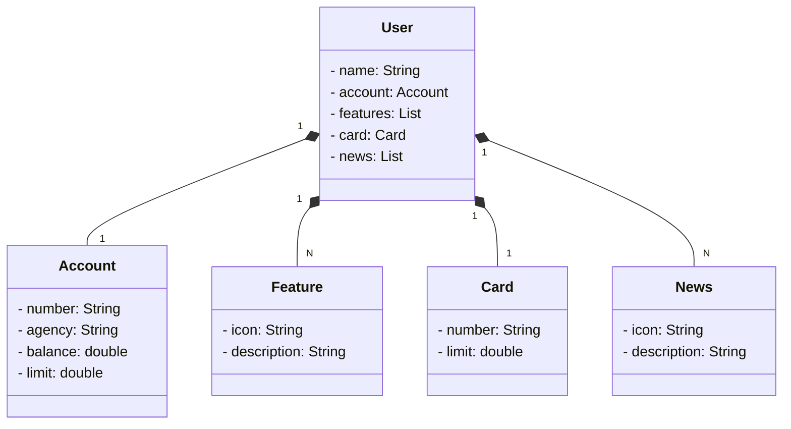

# Santander-Bootcamp-2023-Wesleysp
Java RESTFul API de finalização do bootcamp Santander 2023 estruturacdo com a ajuda das aulas dentro do bootcamp 

##
# Diagrama de Classe

```mermaid
classDiagram
    class User {
        - name: String
        - account: Account
        - features: List<Feature>
        - card: Card
        - news: List<News>
    }

    class Account {
        - number: String
        - agency: String
        - balance: double
        - limit: double
    }

    class Feature {
        - icon: String
        - description: String
    }

    class Card {
        - number: String
        - limit: double
    }

    class News {
        - icon: String
        - description: String
    }

    User "1" *-- "1" Account
    User "1" *-- "N" Feature
    User "1" *-- "1" Card
    User "1" *-- "N" News
```

